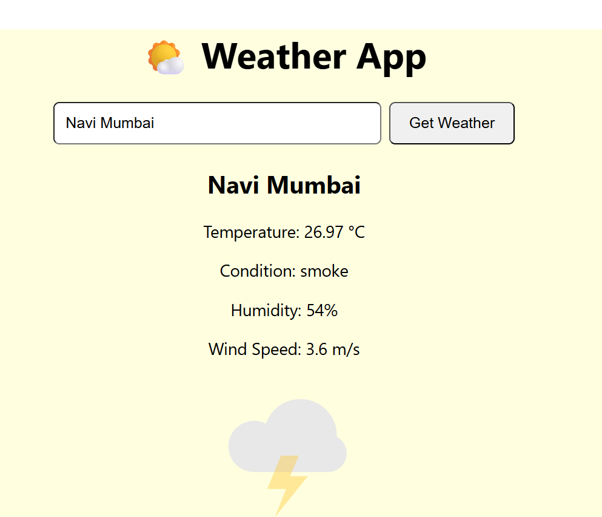

<h1/>📄 Weather App – GitHub Description<h1>
<h2>🌤️ Overview</h2>
A simple yet interactive Weather Application built with React.js that fetches real‑time weather data using the OpenWeather API. The app provides current temperature, humidity, wind speed, and weather conditions with engaging Lottie animations for a modern user experience.

<h2>✨ Features<h2/>
🔍 City Search with Autocomplete – type a city name and get instant suggestions.

🌡️ Live Weather Data – displays temperature, humidity, wind speed, and condition.

🎬 Animated Icons – dynamic Lottie animations for sunny, cloudy, and rainy weather.

🎨 Beautiful UI – gradient background with styled input, buttons, and weather report box.

⚡ Error Handling – alerts if a city is not found.

📱 Responsive Design – works smoothly across devices.

<h2>🛠️ Tech Stack<h2/>
React.js (Frontend framework)

Axios (API calls)

OpenWeather API (Weather data)

Lottie‑React (Animations)

CSS3 (Styling with gradient background and custom components)
<h2>Screenshot<h2/>
  

